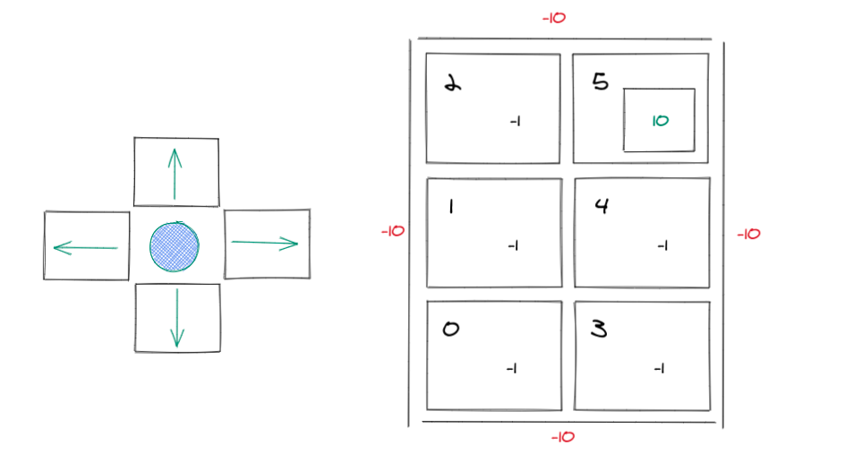

# Q-learning
Adaptive Cognitive Agents Exercise - Q-learning



- Parameters:
```
Alpha = 0.5
Gamma = 0.8
Actions Order = [UP, DW, LF, RG]
```
- Rewards:
```
Rewards of -1.
- Except for terminal state, which is +10.
- If colide with walls reward is -10.
```
- Episodes:
```
Episode 1
Initial State: 0
Actions: Up, Up, Up, Right
```
```
Episode 2
Initial State: 4
Actions: Right, Right, Left, Up
```
#### Final Values:
```
 [[-5.   0.   0.   5. ] | [ 0.   0.   0.   0. ]]

 [[-0.5  0.  -5.  -0.5] | [ 5.   0.  -0.5  0. ]]

 [[-0.5  0.   0.   0. ] | [ 0.   0.   0.   0. ]]
```


#### Final Policy:
```
 ['RG', '+10'] 
 ['DW', 'UP'] 
 ['DW', 'UP']
```
